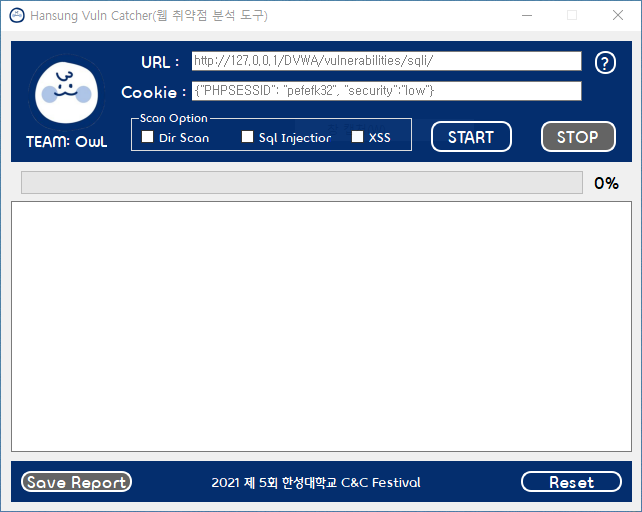
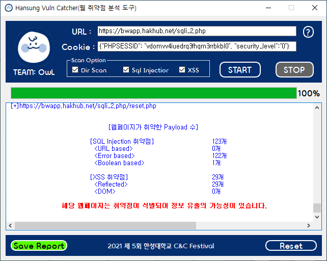

# Hansung_vuln_detector(웹 취약점 분석 도구) 
 2022 hansung C&C festival 출품작 

<b>웹 취약점 분석 도구를 통한 보안 취약점 식별</b>
 
 
OWASP에서 지정한 웹 애플리케이션 보안 취약점 중 SQL injection과 XSS가 취약한 부분을 탐지하기 
위해 URL과 쿠키를 통해 웹 페이지에 대한 정보를 읽고 알고리즘을 구성하여 취약점을 식별하고 보고서 
형태로 출력하며 보안적 관점에서의 문제를 한눈에 인지할 수 있다. 
 

 
<b>사용방법</b>
1. 웹 취약점을 탐색할 URL을 입력창에 입력한다.
2. 웹 브라우저의 개발자 도구 - 어플리케이션 - 쿠키 값을 찾아서 예시 형태로 입력한다.(크롬 기준)
3. SCAN 옵션을 선택하고 START 버튼을 누른다.
 1) DIR SCAN : 버튼이나 하이퍼링크 등으로 연결된 웹페이지의 주소를 탐색해서 보여준다.
 2) SQL INJECTION : URL에 페이로드를 넣어 오류를 유발하거나, Form을 탐색하여 input에 페이로드를 통한 오류발생을 유발 혹은 boolean방식을 이용하여 참, 거짓이 다른 결과를 줄 때 취약함을 판단한다.
 3) XSS : From을 탐색하여 input에 xss_payloads_list를 사용하여 요청 메세지를 보내고 응답 메세지에 보낸 payload가 포함되어 있으면 Reflected XSS 취약점이 있음을 판단하거나 해당 URL에 스크립트를 가져와 Java script Location 관련 구문이 포함되어 있으면 해당 위치에 script를 삽입할 수 있는 가능성이 있어 DOM XSS 취약점이 있음을 판단한다.
4. SCAN이 완료된 후 SAVE REPORT 버튼을 통해 상세 결과를 파일로 저장할 수 있다.
